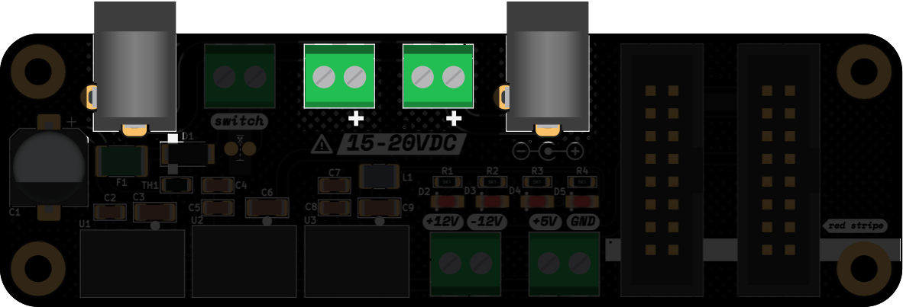
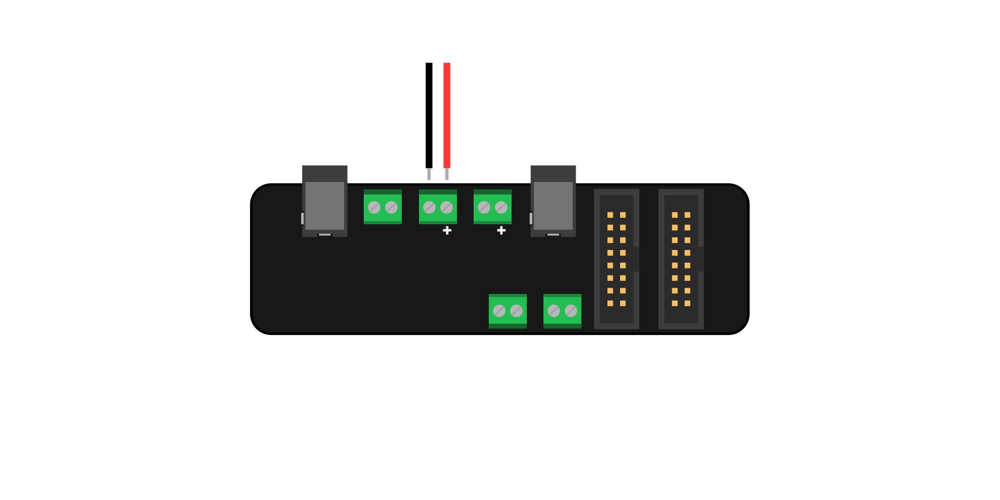
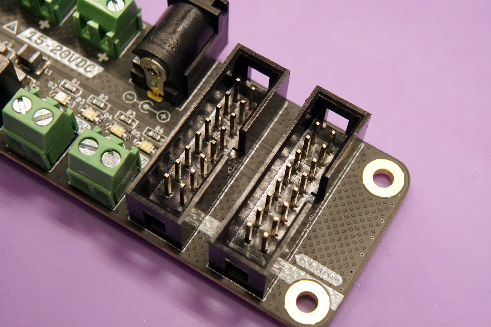
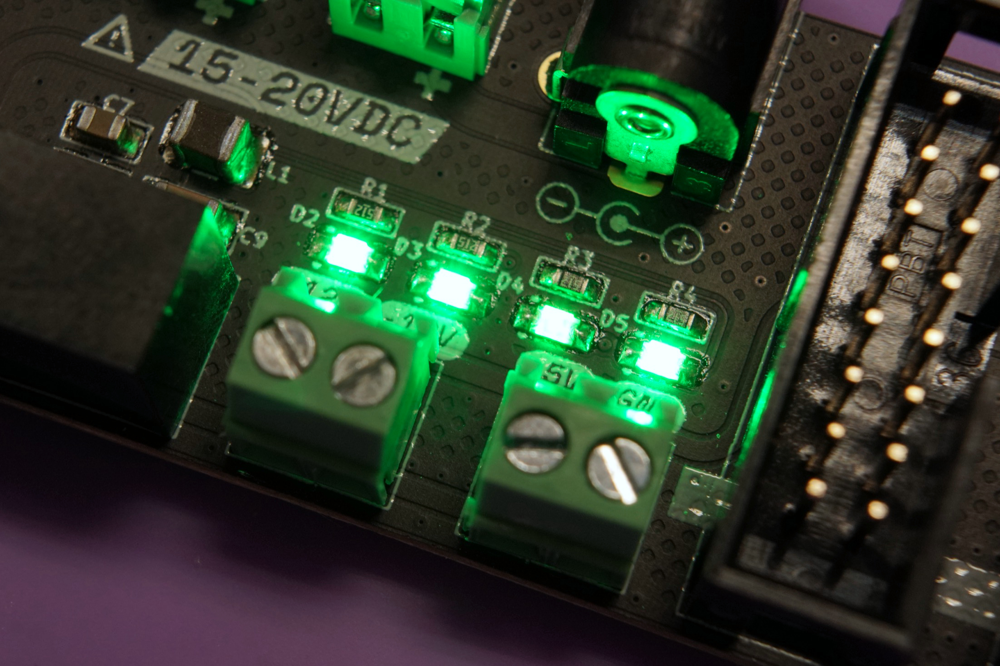
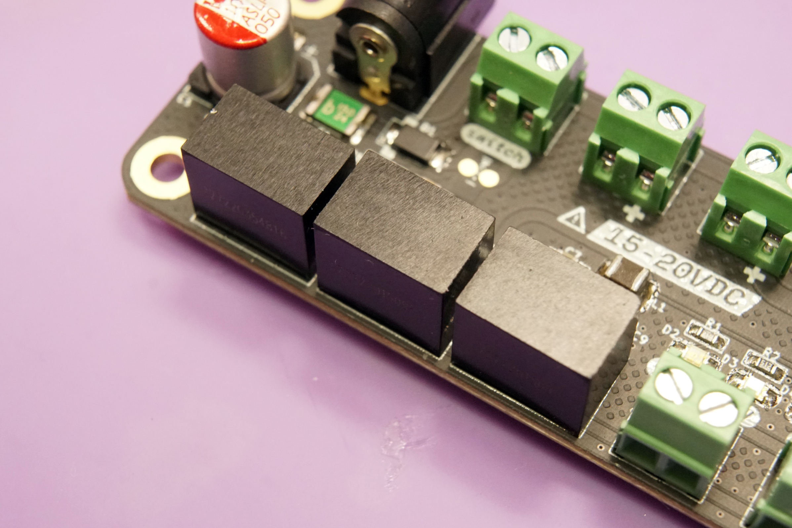
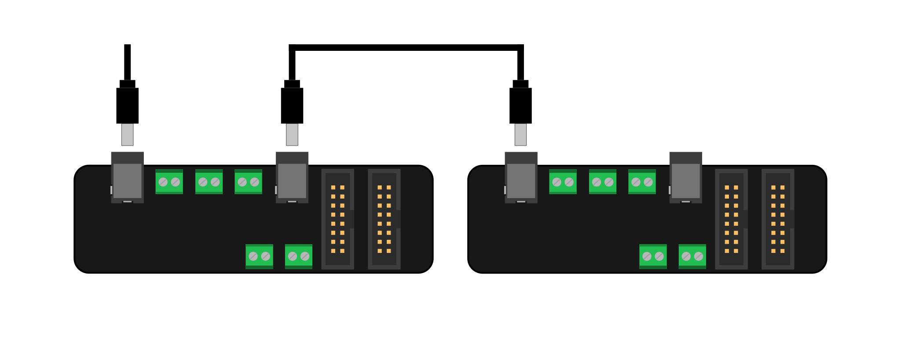
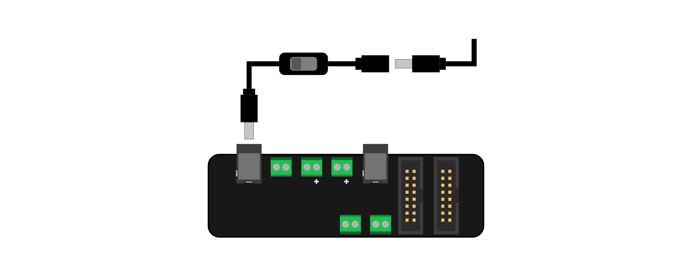
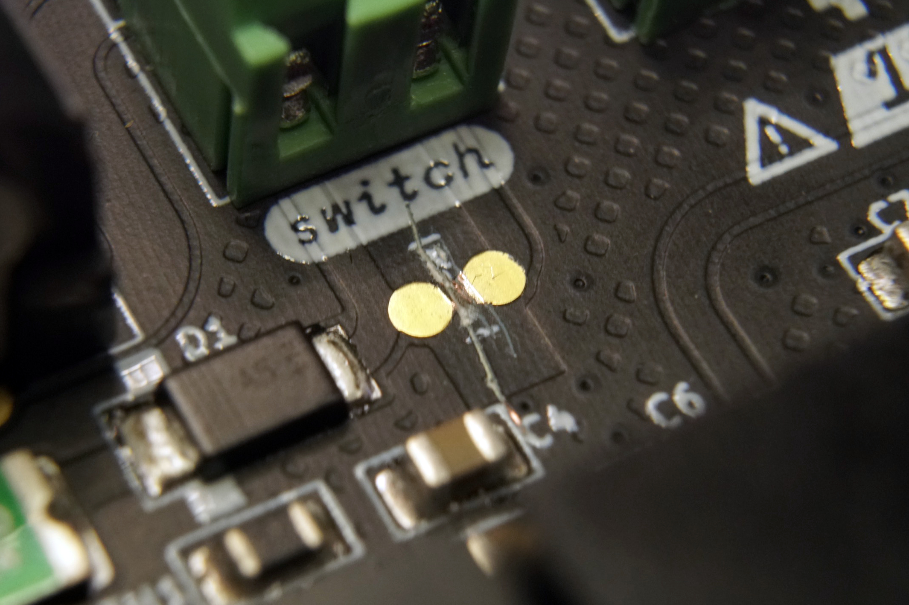
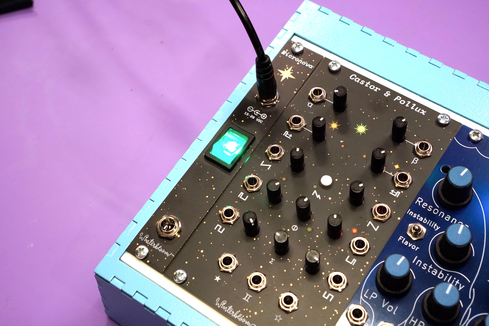
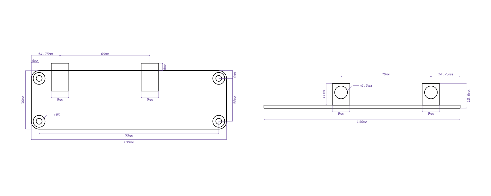

# Micronova User Guide

[Micronova](https://winterbloom.com/shop/micronova) is a tiny but mighty Eurorack power supply. It is our love letter to the DIY ethic of the Eurorack community. It packs a lot of useful little features into a small frame and it's perfect for custom rack builds.

[TOC]

## Specifications

* Available [assembled](https://winterbloom.com/shop/micronova) or as a [kit](https://winterbloom.com/shop/micronova-kit)
* Provides +12V @ 1A, -12V @ 300mA, and +5V @ 500mA
* Include two 16-pin Eurorack power headers
* Requires a 15V to 20V center positive DC power supply
* Multiple units can be daisy chained
* Reverse-polarity, over-current, and over-temperature protection
* Optional 4hp [front entry kit](https://winterbloom.com/shop/micronova-entry-kit)
* Optional [busboard](https://winterbloom.com/shop/micronova-busboard-kit)
* [ModularGrid page](https://www.modulargrid.net/e/winterbloom-micronova)

## Safety

Always use caution when working with electricity. While Micronova does not use mains power directly and operates on relatively low voltages (-12V to 20V DC), there is always risk. Never add or remove downstream devices or modify power connections while the system is powered on. Make sure to use an [appropriate AC to DC power supply](#powering-micronova) and to stay within the specified [power limits](#power-limits). Use high-quality cables and appropriately sized wires when making connections.

Micronova includes some protection features:

- It can withstand at least 30V of reverse polarity on the power inputs
- It has transient voltage suppression on the power inputs
- It has a polyfuse to limit current during a short circuit fault
- It has independent over-current, short circuit, and over-temperature protection on each of the downstream power rails

These protection features do not avert all risks involved with operating a power supply. Micronova can still experience dangerous, unexpected events. Improper usage significantly increases the possibility of electric shock and fire. **Always use caution**.

## Powering Micronova

Micronova requires a 15-20V DC power supply that can provide **at least** 1A. Micronova has multiple, *interconnected* power input connections. It can be powered using one of the DC barrel jacks or one of the screw terminal blocks on the upper side of the board.

!!! warning
    Never connect more than one upstream power supply at a time to Micronova. The multiple DC jacks and screw terminals for *daisy chaining* multiple Micronova units to a single upstream supply. Only **one** upstream power supply should be connected. Connecting multiple upstream power supplies can result in damage, electric shock, fire, and bodily harm.

In most cases, you'll want to use one of the DC barrel jacks. Both Micronova and the optional front entry panel have DC barrel jacks, and either of the two will work. They accept plugs that have a 2.1 mm inner diameter and a 5.5 mm outer diameter. The plug should be **center positive**.

These AC to DC power supplies are recommended if you're planning to use the DC barrel jacks:

* Mean Well [GST60A15-P1J](https://www.digikey.com/en/products/detail/mean-well-usa-inc/GST60A15-P1J/7703713) which provides 15V @ 4A (60W), enough to power four Micronovas.
* Mean Well [GST40A15-P1J](https://www.digikey.com/en/products/detail/mean-well-usa-inc/GST40A15-P1J/7703705) which provides 15V @ 2.6A (40W), enough to power two or three Micronovas.
* Mean Well [GST25A15-P1J](https://www.digikey.com/en/products/detail/mean-well-usa-inc/GST25A15-P1J/7703649) which provides 15V @ 1.6A (25W), enough to power one Micronova.

All of these power supplies are rated for international use and require a separate [IEC C13 cord](https://en.wikipedia.org/wiki/IEC_60320#C13/C14_coupler) to connect to your wall outlet. These cords are incredibly common and often used with computers, monitors, and professional audio and video equipment and should be readily available from local retailers.

If you need help finding a power supply or want to double check compatibility before purchasing, please [reach out to us](mailto:support@winterbloom.com).

In some advanced or unusual racks, you may want to power Micronova through its screw terminals. This might be the case if you're using a large DC power supply such as Mean Well's [RS series](https://www.digikey.com/en/products/detail/mean-well-usa-inc/RS-150-15/7706170). Ensure that the power supply's voltage output is between 15V and 20V. You can use either of the two screw terminal blocks on the upper side of the board (but not the one labeled `switch`). Connect the power supply to Micronova using appropriately sized hook up wire (20 or 22 AWG stranded is recommended).

## Connecting modules

Connect your modules to Micronova using either 16-to-10 pin IDC cables or 16-to-16 pin IDC cables.

    

        
    

    

        
    

Be careful to note the polarity of the cable and the connectors on your modules. Polarity indication on modules varies from manufacturer to manufacturer, but most note the side that the red stripe should be on.

Micronova uses keyed headers so it shouldn't be normally possible to connect power cables backwards on that end.

If you'd like to power more than two modules, you can use a [Busboard](#busboard) or a [flying bus cable].

[flying bus cable]: https://www.thonk.co.uk/shop/bus-cables/

## Power limits

Micronova has limits on how much power it can provide to downstream modules:

- +12V rail: 1A
- -12V rail: 300mA
- +5V rail: 500mA

When connecting multiple modules make sure that the overall current draw does not exceed these limits. Check with each module's manual or manufacturer to determine the current required. If your set up requires more power than a single Micronova can provide, you can [daisy chain](#daisy-chaining) multiple units.

!!! Warning
    Overloading Micronova can cause irreversible damage to Micronova and connected modules.

There are a few ways you can check to make sure that you're within Micronova's limits. The first, and easiest, is to check the four LEDs on the board. They should all be illuminated and three of them should be roughly the same brightness, with the one near the `5V` label being slightly dimmer. Any LEDs that are not illuminated or are very faint indicate an issue with your setup. The photo below shows a correctly functioning unit.

The second way is to check the temperature of Micronova's DC-DC converters. These are the three black boxes on the lower-left of the board. You use a touchless thermometer, thermal camera, or touch the top of them with your finger. It is normal for them to be slightly warm but excessive heat means that Micronova is overloaded.

## Busboard

Micronova's two power outputs can be expanded using the [optional busboard](TODO). You'll need to connect Micronova to the busboard using the included 16 pin IDC cable.

.

When connecting multiple modules, make sure to stay within Micronova's [power limits](#power-limits). If you need more power than one Micronova can provide, you can [daisy chain](#daisy-chaining) two or more units.

## Daisy chaining

You can power multiple Micronova units from a single DC power supply. If the Micronova units are in separate cases, you can connect them together using a [DC jumper cable]:

If you have more than one unit within a single case, you can connect them together using the screw terminal blocks:

You can use any combination of the DC jacks and screw terminals to daisy chain **as long as there is only one power supply**. Make sure your power supply can provide enough power to satisfy the current demand of the Micronova units. A good rule of thumb is that you need 1A to 2A for each Micronova.

[DC jumper cable]: https://www.thonk.co.uk/shop/right-angle-barrel/

## Power switch

In some cases you may want to add a power switch to Micronova, such as cases where it's hard to unplug or reach the power supply. There are a few options.

First, if you're using the [front entry kit](#front-entry-kit) there's a power switch on there, so you're all set!

Second, you can use an [in-line DC power switch]. This is connected between your AC to DC power supply and Micronova's DC barrel jack. This is useful for small cases where it's easy to reach the power cable and helps reduce wear on the power cable since you don't have to constantly plug and unplug it.

[in-line DC power switch]: https://www.adafruit.com/product/1125

Lastly, you can wire a switch to Micronova's `switch` screw terminal block. This is useful in cases where the power cable is not easily accessible or you're powering Micronova through a large DC power supply. You'll need to wire each terminal of the switch to the terminal block as shown:

For the switch to operate, you'll need to sever the copper trace beneath the switch terminal block.

The trace is shown in red. Use a sharp utility knife or razor blade and carefully cut along the dot lines. There is extra empty space around the trace to make it easier to cut without damaging anything.

If you change your mind later and no longer need the switch, you can either place a jumper wire between the two terminals on the terminal block or solder the two pads next to the severed trace together.

## Output terminals

In addition to the two Eurorack 16-pin power headers, Micronova can provide downstream power through the two screw terminals located on the lower side of the board.

Always be aware of Micronova's [power limits](#power-limits) when connecting downstream devices.

## Front entry kit

If you prefer connecting your case's power supply through the front, the [optional front panel kit] provides a 4hp panel with two DC barrel jacks and an illuminated power switch.

This is only available as a kit, please refer to the [build guide](/build#front-entry-kit) for instructions on how to assemble and connect the front entry kit.

[optional front panel kit]: TODO

## Dimensions

If you'd like to physically mount your Micronova in your case, the following dimensions may be useful.

You can also refer to the [KiCAD] files for the [board's hardware design].

[KiCAD]: https://kicad.org
[board's hardware design]: https://github.com/wntrblm/Micronova/tree/main/hardware/board

## Getting support and help

We want you to have a wonderful experience with your power supply. If you need help or run into problems, please reach out to us. Email is the best way for product issues, whereas Discord and GitHub are great for getting advice and help on how to customize your module.

* Send us [an email](mailto:support@winterbloom.com)
* File a bug [on GitHub](https://github.com/wntrblm/Micronova/issues)
* Reach out on the [Discord][discord]

[discord]: https://discord.gg/C5EH3N3fsk

## Open source hardware & software

Micronova is completely open source and hacking is encouraged.

The [hardware designs](https://github.com/wntrblm/Micronova/tree/main/hardware) are available under the permissive [CERN-OHL-P v2](https://cern-ohl.web.cern.ch/) and is designed using [KiCAD](https://kicad.org/) which is free and open-source. You can open the hardware files using KiCAD or you can [check out a PDF of the schematic](https://github.com/wntrblm/Micronova/tree/main/hardware/board/board.pdf).

<!-- {class=oshw} Micronova is [certified open source hardware](https://certification.oshwa.org/us002071.html) TODO -->

## Warranty, disclaimers, and limits

Micronova is a subcomponent used by the customer as part of a larger overall system. Because Winterbloom does not have any control over other subcomponents within the customer's system (including, but not limited to, the AC to DC power supply used to provide power to Micronova and any modules powered by Micronova), Winterbloom bears no responsibility for any damage caused to other subcomponents.

Micronova units purchased from Winterbloom have a warranty of six months from the date of purchase. This warranty covers any manufacturing defects in the module. It does not cover damage from due to incorrect handling, storage, or power, overvoltage events, or modifications.

Please [contact us](mailto:support@winterbloom.com) if you are experiencing issues with your unit. Units returned under warranty will either be refunded, replaced, or repaired at our discretion. You will be responsible for the cost of returning the module to Winterbloom.

Because Eurorack has a vast number of possible combinations of power supplies, modules, cases, and accessories, it is impossible for us to guarantee compatibility with every possible configuration. We make a reasonable effort to test our products with several power supplies, cases, and other modules.

We encourage tinkering, however, we will not refund, repair, or replace any products that have been modified.

We have stress tested Micronova under the following conditions. These are provided for reference only; we do not guarantee that that the product will function under these conditions or continue to function if exposed to these circumstances.

* Continuous run time of at least 48 hours
* Overvoltage at power input up to 24V
* Undervoltage at power input down to 13V
* Reverse voltage at power input up to 30V
* Short circuit at power outputs triggers thermal overload
* +12V power output up to 2A before thermal overload
* -12V power output up to 1A before thermal overload
* 5V power output up to 1A before thermal overload
* 1 hour thermal overload recoverable
* Polyfuse trip time under 5 seconds
* Polyfuse recovery time under 1 minute

## Acknowledgments and thanks

Micronova would not be possible without the support of Winterbloom's incredible community.
